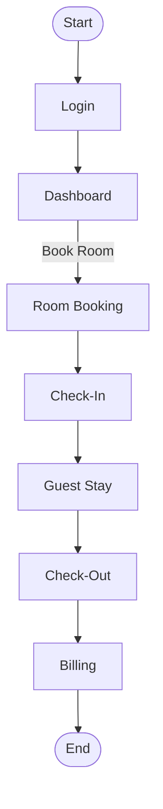

# Hotel Management System

A comprehensive hotel management system designed to streamline hotel operations, manage guest services, and improve the overall guest experience. This repository provides a robust solution for property owners, managers, and front desk staff to handle bookings, rooms, billing, and customer information efficiently.

---

## Introduction

The Hotel Management System automates common hotel workflows such as room booking, check-in/check-out, billing, and customer management. Developed for educational and commercial use, this project showcases best practices in software architecture, modular design, and database management for the hospitality industry.

---

## Installation

To set up the Hotel Management System locally, follow these steps:

1. **Clone the repository:**

   ```bash
   git clone https://github.com/Kushan20070126/Hotel_management-_system.git
   ```

2. **Navigate to the project directory:**

   ```bash
   cd Hotel_management-_system
   ```

3. **Install dependencies:**
   Ensure Java 21 and Apache NetBeans are installed.

   ```bash
   # Java download
   https://www.oracle.com/apac/java/technologies/downloads/
   # NetBeans download
   https://netbeans.apache.org/front/main/download/
   ```

4. **Set up the database:**
   Configure MySQL or SQLite database using `DBConnection.java`.

   ```java
   jdbc:mysql://localhost:3306/hotel_db?useSSL=false
   user = root
   pass = ""
   ```

5. **Configure environment variables:**
   Update configuration files with your database credentials and environment-specific settings.

6. **Run the application:**

   ```bash
   App.java ->
   mvn clean install
   mvn exec:java -Dexec.mainClass="App"
   ```
Connects to MySQL without a database.
Checks if hoteldb exists; if not, creates it and tabels are same.
Connects to the new database
7. **Password is SHA-256 hash:**

   ```bash
   INSERT INTO users(username, password, role) 
                VALUES ('admin', '8c6976e5b5410415bde908bd4dee15dfb167a9c873fc4bb8a81f6f2ab448a918', 'Admin');
// public static String HashPassword(String password){
//    
//     try {
//         
//         MessageDigest mg = MessageDigest.getInstance("SHA-256");
//         byte[] diget = mg.digest(password.getBytes());
//         BigInteger intg = new BigInteger(1,diget);
//         
//         System.out.println("password : " + intg.toString(16));
//         return intg.toString(16);
//         
//     } catch (Exception e) {
//         
//         System.out.println("Password hashing error: " + e.getMessage());
//            return null;
//     }
//    
// }

//       HashPassword("admin"); -> call it pass word


   ```
---

## Features

* Room booking and availability management
* Guest registration and profile management
* Check-in and check-out automation
* Billing and invoicing
* Room status tracking (vacant, occupied, cleaning, etc.)
* Staff and user role management
* Dashboard and reporting
* Secure authentication and authorization
* Database backup and restore

---

## Requirements

* Java 21
* MySQL, SQLite, or PostgreSQL for database
* Apache NetBeans IDE
* Optional: Docker for containerized deployment

---

## Usage

After installation, launch the system and access the dashboard via the application.

* **Login:** Enter credentials on the login page.
* **Book a Room:** Navigate to booking, select room type, assign to a guest.
* **Check-in/Check-out:** Manage guest stays.
* **Billing:** Generate invoices and process payments.
* **Admin Panel:** Manage rooms, staff, and system settings.

### Example Usage Flow



---

## Contributing

We welcome contributions:

* Fork the repository
* Create a new branch
* Commit changes with clear messages
* Submit a pull request

Follow code style guidelines and ensure tests pass.

---

## License

This project is licensed under the MIT License.

```card
{
    "title": "MIT License",
    "content": "You are free to use, modify, and distribute this software with proper attribution. See LICENSE file for details."
}
```

---

Thank you for your interest. For questions or support, open an issue or contact maintainers via GitHub.
